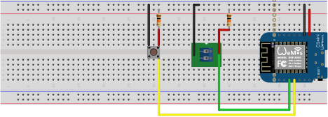
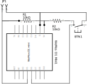

# esp-ohc - Log time with WeMosD1 mini 

You can start timer with `JP1` close. Runtime calculated on `JP1` open.

`BTN1` reset sumtime.

You can see actual `JP1` status, runtime and sumtime in browser. Use MDNS name.

See `config.h.example` For WIFI and MDNS settings.

## Bread board wiring

## Circuit diagram

